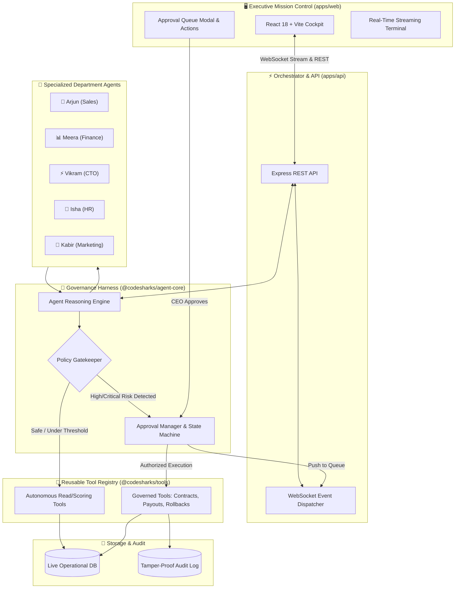

<div align="center">

# 🦈 CodeSharks • Enterprise Agentic Harness
### *Autonomous Multi-Agent Operations with Human-in-the-Loop Governance*

[](https://github.com/Anish974/HackPulse-CodeSharks-Harness)
[](https://github.com/Anish974/HackPulse-CodeSharks-Harness)
[](https://github.com/Anish974/HackPulse-CodeSharks-Harness)
[](LICENSE)

<br/>

> **"Unconstrained autonomous agents are an enterprise liability. CodeSharks creates a deterministic governance perimeter where specialized agents autonomously plan and execute routine workflows, while high-risk critical actions are halted and queued for executive sign-off."**

[Live Architecture](#-system-architecture) • [Department Agents](#-departmental-agent-roster) • [Quickstart](#-quickstart-guide) • [3-Minute Judge Pitch](#-3-minute-judge-demo-script) • [Documentation](docs/)


<div align="center">
  
</div>

---

</div>

## 🌟 Key Highlights

- 🛡️ **Human-in-the-Loop (HITL) Gatekeeper**: Intercepts actions involving legal contracts, financial liability (> ₹50,000), or infrastructure mutations before execution.
- ⚡ **Real-Time WebSocket Telemetry**: Live streaming terminal showing agent reasoning (`Thought ➡️ Tool Selection ➡️ Policy Check ➡️ Paused for Approval`).
- 🏢 **Multi-Department Specialization**: 5 domain-specific autonomous agents (Sales, Finance, Tech, HR, Marketing) coordinated by an Executive Orchestrator.
- 📦 **Production-Grade Monorepo**: Completely decoupled packages (`@codesharks/shared`, `@codesharks/tools`, `@codesharks/agent-core`) feeding into `apps/api` and `apps/web`.
- 📊 **Executive Command Cockpit**: Premium dark-mode glassmorphic dashboard with live KPI metrics, approval queue diffs, and instant one-click preset scenario simulators.
- 📜 **Tamper-Proof Audit Trail**: Cryptographically logged execution records verifying who authorized what, when, and with what parameters.

---

## 🏛️ System Architecture



---

## 👥 Departmental Agent Roster

<div align="center">

| Department | Agent | Persona & Title | Autonomous Capabilities | Governed Actions (Requires Sign-Off) |
| :---: | :---: | :--- | :--- | :--- |
| 💼 | **Arjun** | VP of Sales & Growth | Lead scoring, CRM qualification, enterprise deal triage | Commercial binding contracts (`send_external_contract` > ₹50,000) |
| 📊 | **Meera** | Head of Finance & Risk | Accounts receivable audits, routine payment reminders | High-debt demands, debt discounts, settlement waivers |
| ⚡ | **Vikram** | CTO & Infrastructure Guard | Telemetry triage, stack trace diagnosis, cluster logs | Production rollbacks, hotfix deployment (`deploy_production_hotfix`) |
| 👥 | **Isha** | People Operations Lead | Resume screening, candidate portfolio scoring | Official employment offer letters (`send_employment_offer` > ₹20L CTC) |
| 🚀 | **Kabir** | Creative Director | Content brainstorming, viral hooks, copywriting | Paid advertising spend authorization (`publish_sponsored_campaign`) |
| 🧠 | **AYUS** | Executive Orchestrator | Inter-departmental handoffs, daily CEO synthesis | System-wide policy thresholds and fail-safe triggers |

</div>

---

## 🛡️ Governance Policy & Risk Perimeter

The harness intercepts actions based on strict deterministic mathematical and operational boundaries:

```
[ Incoming Action ]
        │
        ▼
Is tool in MANDATORY_APPROVAL list? ────► YES ──► ⛔ HALT & QUEUE FOR CEO
        │ (No)
        ▼
Is financial amount > ₹50,000? ────────► YES ──► ⛔ HALT & QUEUE FOR CEO
        │ (No)
        ▼
Is discount rate > 15%? ────────────────► YES ──► ⛔ HALT & QUEUE FOR CEO
        │ (No)
        ▼
✅ SAFE: Execute immediately & stream result
```

---

## 📁 Monorepo Workspace Structure

```text
HackPulse-CodeSharks-Harness/
├── .agents/
│   ├── skills/
│   │   ├── agentic-harness-ops/     # Extension & operational playbook
│   │   └── hackathon-pitch-guide/   # 3-minute pitch & judge defense script
│   └── rules/
│       └── agentic-standards.md     # Governance safety standards
├── docs/
│   ├── ARCHITECTURE.md              # Deep system design & sequence diagrams
│   ├── PROBLEM_STATEMENT_ALIGNMENT.md # 1-to-1 HackPulse Problem 04 mapping
│   ├── AGENTS_AND_DEPARTMENTS.md    # Detailed specifications for all 6 agents
│   ├── GOVERNANCE_AND_SAFETY_POLICY.md # Risk matrix & audit compliance
│   └── API_AND_WEBSOCKET_SPEC.md    # REST endpoints & WebSocket payloads
├── packages/
│   ├── shared/                      # Domain enums, constants, formatters
│   ├── tools/                       # Reusable Tool Registry & Operational DB
│   └── agent-core/                  # Reasoner, Planner & Approval State Machine
├── apps/
│   ├── api/                         # Node.js + Express REST & WebSocket Server
│   └── web/                         # React 18 + Vite Executive Cockpit
├── scripts/
│   └── verify-monorepo.js           # Automated end-to-end test suite
├── package.json                     # Monorepo workspaces definition
└── README.md
```

---

## 🚀 Quickstart Guide

### Prerequisites
- Node.js (v20 or higher)
- npm (v10 or higher)

### 1. Installation
Clone the repository and install all monorepo dependencies in a single step:
```bash
git clone https://github.com/Anish974/HackPulse-CodeSharks-Harness.git
cd HackPulse-CodeSharks-Harness
npm install
```

### 2. Verify Monorepo Integrity
Run the built-in automated test suite to verify all package linkages, tools, and the approval harness:
```bash
node scripts/verify-monorepo.js
```

### 3. Launch the Stack
Start both the backend API and frontend React dashboard concurrently:
```bash
npm run dev
```

* 🖥️ **Executive Cockpit Dashboard:** [http://localhost:5173](http://localhost:5173)
* 📡 **API & Real-time WebSocket:** [http://localhost:3001](http://localhost:3001)

---

## 🎤 3-Minute Judge Demo Script

| Timing | Action on Screen | What to Say to the Judges |
| :--- | :--- | :--- |
| **0:00 - 0:45** | Show Dashboard KPI cards | *"Autonomous agents without safety guardrails hallucinate discounts and create real-world legal liabilities. We built the CodeSharks Agentic Harness to solve this."* |
| **0:45 - 1:15** | Click **"💼 Enterprise Deal (₹1.5L Contract)"** | *"Watch Sales Agent Arjun qualify the lead autonomously. But when proposing a ₹1.5L contract (> ₹50k limit), the Harness Gatekeeper intercepts and freezes the action."* |
| **1:15 - 1:45** | Click **"Approve & Execute"** | *"The CEO reviews the policy justification and signs off with one click. The action executes immediately and logs to an immutable audit trail."* |
| **1:45 - 2:30** | Click **"⚡ Run Full Enterprise Sweep"** | *"All 5 department agents execute in parallel, proving scalable multi-agent coordination within an enterprise monorepo."* |
| **2:30 - 3:00** | Open `packages/` directory | *"Built as a strict modular monorepo satisfying every requirement of HackPulse Problem Statement 04."* |

---

## 🏆 HackPulse 1.0 Alignment

| Problem Statement 04 Requirement | Implementation in CodeSharks Harness |
| :--- | :--- |
| **Understand Business Tasks** | 5 specialized agents handling Leads, Invoices, Incidents, Candidates & Campaigns |
| **Tool Execution** | 11 reusable tools in `@codesharks/tools` with structured parameter contracts |
| **Approval for Critical Actions** | Human-in-the-Loop state machine in `@codesharks/agent-core` with risk evaluation |
| **Monorepo Architecture** | npm workspaces separating `packages/*` and `apps/*` cleanly |
| **Agentic Mindset** | Autonomous observation, chain-of-thought planning, error recovery & live telemetry |

---

<div align="center">

Made with 🦈 by **CodeSharks** for **HackPulse 1.0**

</div>
