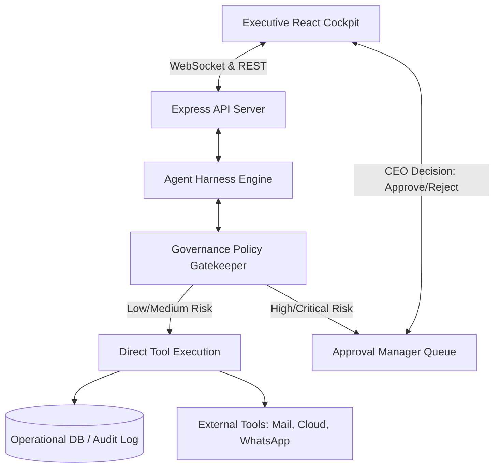

# 🏛️ Architecture & System Design
### CodeSharks Enterprise Agentic Harness

## 1. System Overview
The CodeSharks Agentic Harness is an event-driven multi-agent orchestration framework built with an explicit **Human-in-the-Loop (HITL) Governance Perimeter**.



---

## 2. Sequence Diagram: Human-in-the-Loop Interception Workflow

```mermaid
sequenceDiagram
    autonumber
    actor CEO as Executive (CEO)
    participant UI as Web Dashboard
    participant API as API Server / WS
    participant Engine as Agent Reasoning Engine
    participant Policy as Policy Gatekeeper
    participant Tool as Tool Registry
    participant DB as Audit Trail DB

    CEO->>UI: Triggers Autonomous Cycle / Scenario
    UI->>API: POST /api/agents/SALES/run
    API->>Engine: runWorkflow('SALES')
    Engine->>Engine: Observe State & Generate Step Plan
    Engine->>Policy: evaluateRisk(tool='send_external_contract', value=150000)
    
    rect rgb(40, 20, 20)
        Note over Policy: Value 150k > Threshold 50k
        Policy-->>Engine: { riskLevel: 'CRITICAL', requiresApproval: true }
        Engine->>API: Broadcast Event: agent:paused_for_approval
        API->>UI: WebSocket Push -> Add to Approval Queue
    end

    CEO->>UI: Inspects Proposal & Policy Reason
    CEO->>UI: Clicks "Approve & Execute"
    UI->>API: POST /api/approvals/{id}/approve
    API->>Tool: execute(args)
    Tool-->>DB: Append Immutable Record to Audit Trail
    API->>UI: WebSocket Push -> Status: EXECUTED
```



---

## 3. Package Decoupling & Boundary Isolation

```
@codesharks/shared
  ├── constants.js (Enums, Registry, Thresholds)
  └── index.js (Formatting & Validation)
        ▲
        │ imports
        │
@codesharks/tools
  ├── registry.js (Tool Definitions, Risk Evaluators, DB Store)
  └── index.js
        ▲
        │ imports
        │
@codesharks/agent-core
  ├── approval-manager.js (State Machine & Queue)
  └── engine.js (Planner & Reasoner)
        ▲
        │ imports
        │
apps/api ────────────────► apps/web
(Express + WebSocket)     (Vite + React)
```
